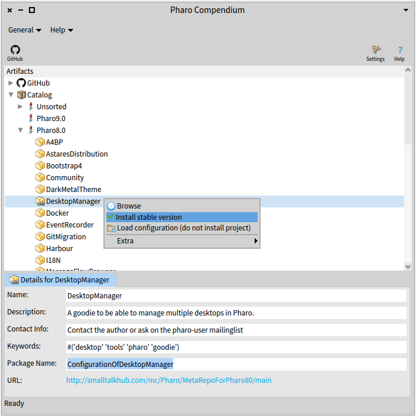

# Pharo-Compendium

Compendium is an in-image tool to list, browse and load Pharo artefacts from the web like:
 - GitHub Projects
 - Catalog Projects
and other

By default there are two plugin packages available for GitHub and Catalog - but you can implement own ones easily to connect to other sources on the web.

# Quick Start
## Installation

```Smalltalk
Metacello new 
	repository: 'github://astares/Pharo-Compendium/src';
	baseline: 'Compendium';
	load
```

Note: the tool only works in Pharo 9 and later as it uses Spec2 UI framework for Pharo

# Screenshots

## GitHub Topic Plugin

This plugin allows you to view, browse and load GitHub projects marked with "pharo" as topic.


## Catalog Plugin

This plugin allows you to view and load (legacy) catalog entries

